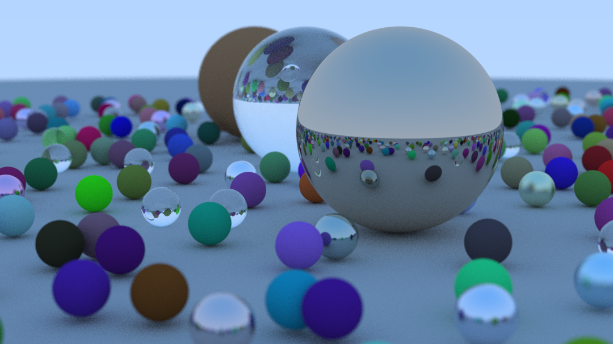
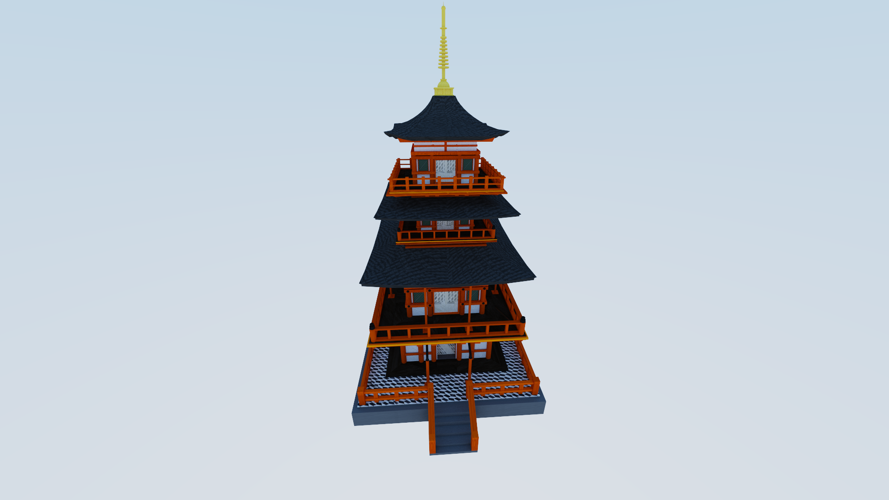
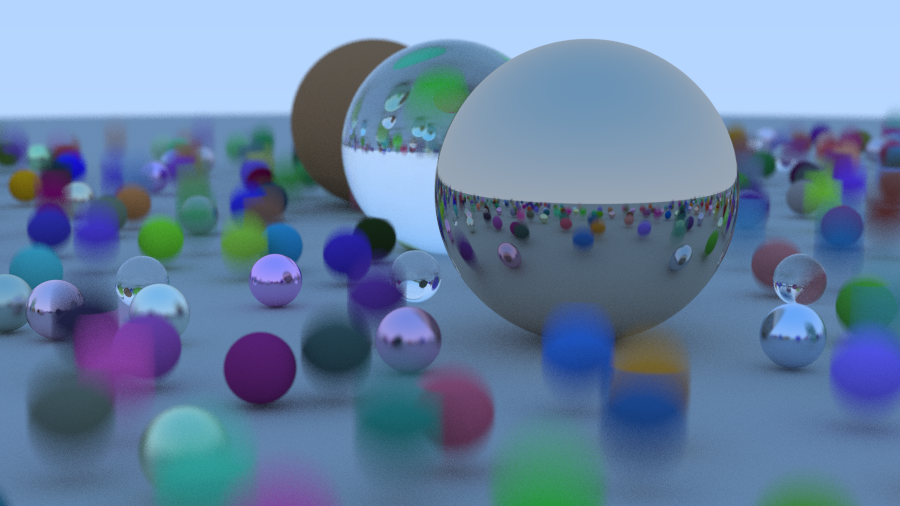
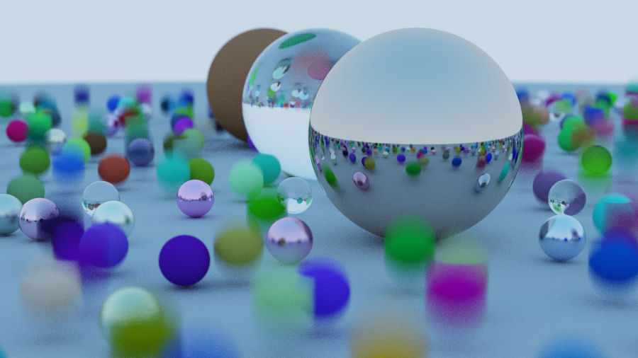
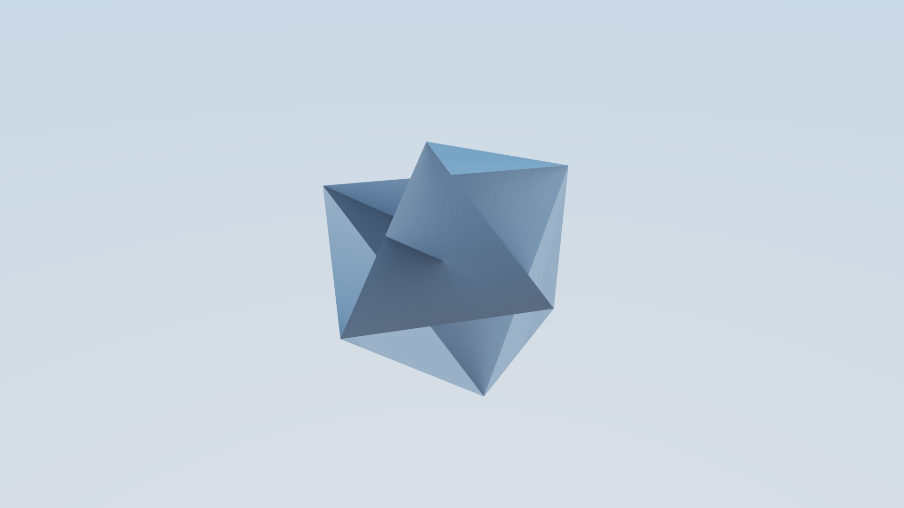
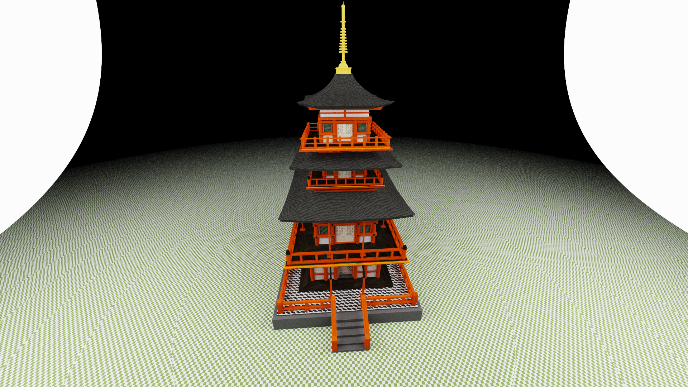
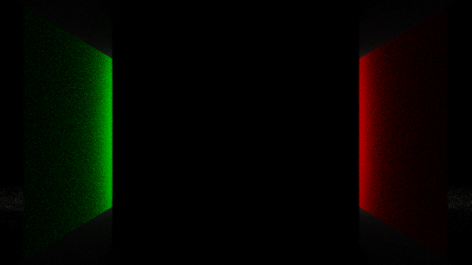

# RayTracingInOneWeekend

Thanks [@Peter_Shirley](https://twitter.com/Peter_shirley) for the awesome series: https://raytracing.github.io/books/RayTracingInOneWeekend.html

### OBJ Mesh Rendering

### Multithreaded Tiled Rendering
- Splits image into 16x16 tiles and renders them in parallel

### ACES Tonemapping
| No Tonemapping  | ACES Tonemapping |
| ------------- | ------------- |
|  |   |

## More Examples

